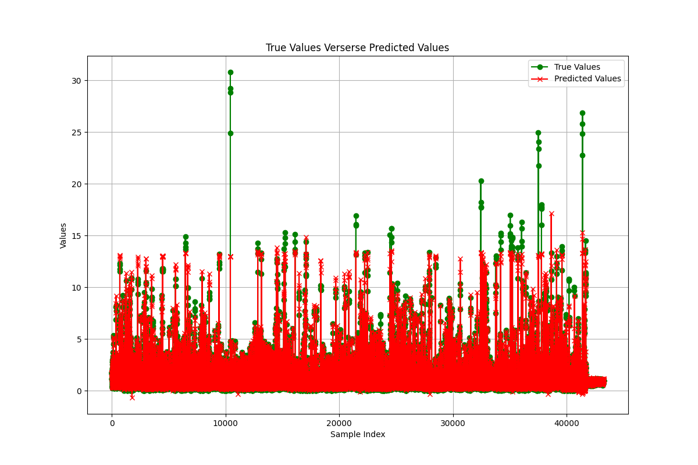
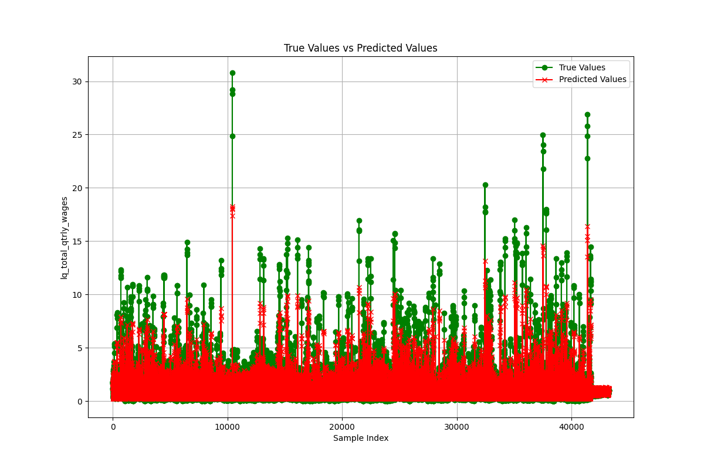
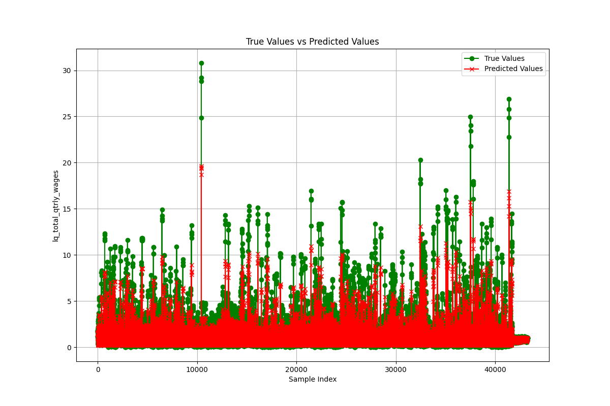

## Data Source

The dataset used in these models is from the [Bureau of Labor Statistics (BLS) downloadable data files](https://www.bls.gov/cew/downloadable-data-files.htm).Specifically, the training part is adstracted from 2022-2023 Service-Provinding, the validating part is abstracted from 2021 Service-Providing.It includes various features related to employment and wages(i.e. `local_qoutient_employment_level` and `local_qoutient_employment_percentage_change_compared_to_previous_year` from the first to third month per quarter,`local_qoutient_contribution`, `local_qoutient_contribution_change` per quarter and `quartly_average_weekly_incomes` per quarter), with the target variable being `local_qoutient_total_quartly_wages`.

**Note**:In the following part, the *Nx* stands for the multiplier applying to both input and output.

## Model 1: Bidirectional GRU

### Key Features:
- **Bidirectional GRU Layers**: Applies GRU layers in both forward and backward directions to capture temporal dependencies.
- **Dropout Layers**: Added to prevent overfitting by randomly dropping units during training.
- **Sequence Processing**: Data is transformed into sequences of length 7 to handle temporal dependencies.

### Main Steps:
1. **Data Loading and Preprocessing**:
   - Load data from CSV.
   - Separate features and target.
   - Apply a multiplier to scale the data.

2. **Sequence Creation**:
   - Define a function to create sequences and corresponding labels.

3. **Model Architecture**:
   - Input layer with shape matching the sequence data.
   - Two Bidirectional GRU layers with Dropout in between.
   - Dense layer to output predictions for each sequence.

4. **Training**:
   - Train the model with early stopping to avoid overfitting.
   - Save the model for future use.

### Model Image:

## Model 2: Dense Neural Network (DL1x)

### Key Features:
- **Fully Connected Layers**: Uses multiple dense layers with ReLU activation to learn complex patterns.
- **Dropout Layers**: Implemented to reduce overfitting by randomly dropping units.
- **Simple Architecture**: Processes input data through fully connected layers without sequence handling.

### Main Steps:
1. **Data Loading and Preprocessing**:
   - Load data from CSV.
   - Separate features and target.
   - Apply a multiplier to scale the data.

2. **Model Architecture**:
   - Input layer with shape matching the feature vectors.
   - Several Dense layers with ReLU activation and Dropout for regularization.
   - Output layer with a linear activation function to predict the target variable.

3. **Training**:
   - Train the model with early stopping to prevent overfitting.

### Model Image:

## Model 3: Dense Neural Network (DL10x)

### Key Features:
- **Extended Fully Connected Layers**: Similar to the DL1x model but with a higher multiplier.
- **Dropout Layers**: Added to handle more complex patterns.
- **Simple Architecture**: Similar to DL1x but with more extensive training.

### Model Image:

### Conclusion:
- **Best Model**: The Bidirectional GRU (BiGRU) model performs better in scenarios where capturing temporal dependencies is crucial, especially for time-series data. As shown images, the DL models are good at exploration , meaning that it will fit into the datas with high bias.But the BiGRU fits in better overall.
